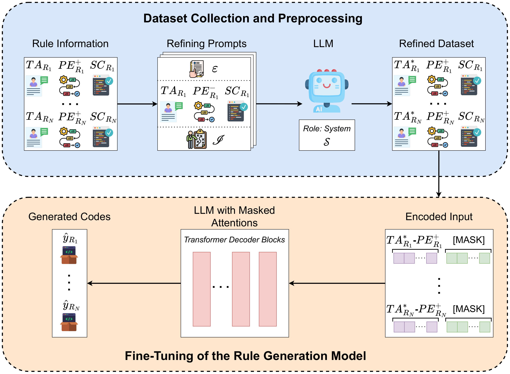
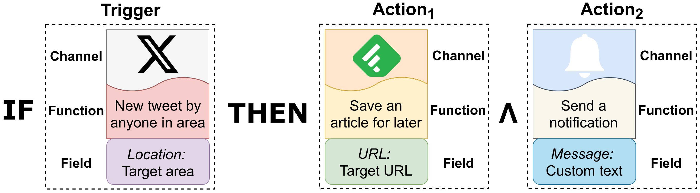
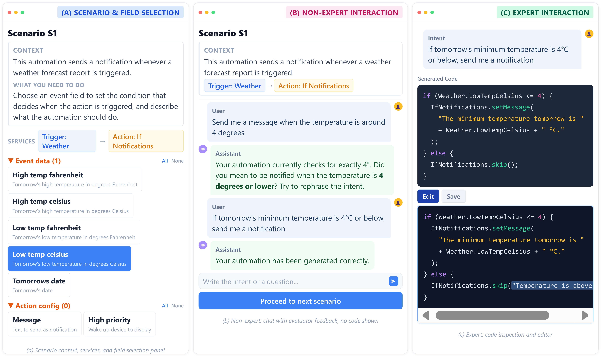
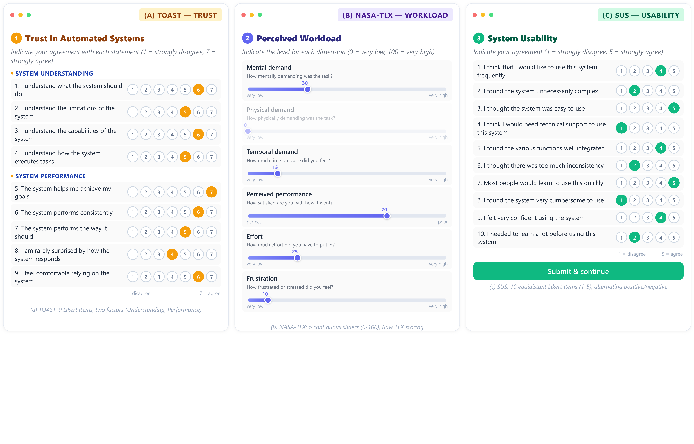

# LLM-Assisted Behavioral Customization for End-User Automation in Trigger-Action Platforms

> **Behaviour & Information Technology** (under revision)

## Abstract

Trigger-Action Platforms (TAPs) are a widely adopted class of End-User Development systems that enable non-programmer users to automate interactions among online services and IoT devices through simple IF-THEN rules. Although advanced mechanisms such as conditional execution and data transformation increase expressiveness, they typically require programming expertise and remain inaccessible to many users, leaving a persistent gap between users' automation needs and what template-based interfaces support.

This paper presents an LLM-assisted approach for behavioral customization in TAPs, enabling the generation of executable filter code from natural language intents. The approach grounds generation in platform-provided catalogs of admissible variables and methods, guiding models toward syntactically valid and deployable solutions, and supports an interactive workflow in which users iteratively refine automation behavior through natural language. We evaluate the approach through a mixed-method study combining automated experiments and a controlled user study. The automated evaluation, conducted on 351 real-world rules, assesses platform compliance and behavioral correctness. The user study, involving 85 participants and 510 tasks, indicates that LLM assistance helps users converge toward correct automations, with success rates above 95%, good perceived usability (SUS M = 69.9), manageable cognitive workload (NASA-TLX M = 24.9), and moderately high trust (TOAST M = 5.1).

**Keywords:** Trigger-Action Platforms, GenAI, No-code Programming, Rule Customization, User Intent Modeling

---

## Method Overview

<p align="center">
  
</p>

The proposed pipeline combines fine-tuned LLMs with explicit platform grounding through an IFTTT catalog of admissible variables and methods. Natural language intents are translated into executable JavaScript filter code through a structured prompting strategy.

<p align="center">
  
</p>

Running example of a trigger-action rule with multiple actions: when a tweet is posted (trigger), the system conditionally saves it to Feedly and sends a notification (actions), with filter code controlling selective execution.

---

## Platform Interface

<p align="center">
  
</p>

Three views of the participant-facing interface:
- **(a) Scenario & Field Selection** — scenario context, services, and selectable API fields
- **(b) Non-Expert Interaction** — natural-language chat with evaluator feedback (no code shown)
- **(c) Expert Interaction** — generated code with inline editor and validation toolbar

---

## Questionnaire Administration

<p align="center">
  
</p>

Three standardized instruments administered after each experimental block:
- **(a) TOAST** — Trust of Automated Systems Test: 9 Likert items (1-7), two factors (Understanding, Performance)
- **(b) NASA-TLX** — Raw Task Load Index: 6 continuous sliders (0-100)
- **(c) SUS** — System Usability Scale: 10 equidistant Likert items (1-5), alternating positive/negative

All scales use equally spaced numeric labels to support interval-level interpretation.

---

## Replication Artifacts

### Dataset

| File | Description | Records |
|:-----|:------------|--------:|
| `data/dataset_train.json` | Training set (GPT-4-refined descriptions) | 2,088 |
| `data/dataset_val.json` | Validation set (GPT-4-refined descriptions) | 298 |
| `data/dataset_test.json` | Test set (original user-authored descriptions) | 351 |
| `data/triggers.json` | IFTTT trigger catalog | 3,620 |
| `data/actions.json` | IFTTT action catalog | 2,491 |

Each rule record contains: `row_index`, `name`, `description`, `trigger_apis`, `action_apis`, `rule_description`, `user_intent_example`, `filter_code`.

### User Study Raw Data

The folder `data/user_study/` contains the user-study data in CSV format along with a self-contained re-computation pipeline.

| File | Description | Records |
|:-----|:------------|--------:|
| `data/user_study/participants.csv` | Participant demographics and condition assignment | 85 |
| `data/user_study/sus_responses.csv` | SUS items 1-10 (1-5 Likert), per participant | 85 |
| `data/user_study/tlx_responses.csv` | NASA-TLX 6 subscales (0-100), per participant | 85 |
| `data/user_study/toast_responses.csv` | TOAST items 1-9 (1-7 Likert), per participant | 85 |
| `data/user_study/scenario_sessions.csv` | One row per scenario session (510 = 85 x 6) | 510 |
| `data/user_study/compute_metrics.py` | Self-contained Python script reproducing every paper metric | -- |
| `data/user_study/analysis.ipynb` | Jupyter notebook walkthrough with markdown sections and inline tables | -- |

### CSVs supporting the additional analyses:

| File | Supports | Section |
|:-----|:---------|:--------|
| `data/representativeness_test_vs_pool.csv` | Feature-level KS comparison between test set (351) and the residual train+validation pool (2,386) | 5.2.3 |
| `data/representativeness_channel_mix.csv` | Per-category trigger/action channel distribution | 5.2.3 |
| `data/api_manual_validation_n50.csv` | Per-rule manual API namespace annotation vs Esprima extraction (N=50 random rules) | 5.4.1 |

### Scripts

| File | Description                                                                        |
|:-----|:-----------------------------------------------------------------------------------|
| `scripts/prompts.py` | Prompt templates: refining prompt (Section 4.1) and generation prompt (Appendix A) |
| `scripts/fine_tune.py` | LoRA/SFT fine-tuning, reproduces all Section 5.1 configurations                    |
| `scripts/representativeness.py` | Regenerates the Section 5.2.3 test-set representativeness CSVs (test vs residual train+val pool) |
| `data/user_study/compute_metrics.py` | Recomputes every user-study metric end-to-end from the raw CSVs                    |

---

## Reproducing User Study Results

Two equivalent entry points: a command-line script and an interactive notebook.

### Option A — Command-line script

```bash
pip install numpy pandas scipy
cd replication_package/data/user_study
python compute_metrics.py
```

The script prints, in a single run, every paper-reported user-study metric:
internal consistency (Cronbach's alpha for SUS / TLX / TOAST), Table 4
questionnaire results by expertise group (M +/- SD, 95% CI, Cohen's d,
Mann-Whitney U), Table 5 behavioural outcomes by complexity class, Spearman
cross-instrument correlations, and the Cohen's kappa inter-rater reliability
added in R2. Output values match the figures reported in the paper within
paper-rounding precision.

### Option B — Jupyter notebook 

```bash
pip install numpy pandas scipy jupyter
cd replication_package/data/user_study
jupyter notebook analysis.ipynb
```

The notebook organises the same metrics into labelled sections with inline
pandas tables, side-by-side comparisons against the paper-reported values,
and short methodological notes after each block.

---

## Reproducing Fine-tuning

```bash
pip install torch transformers peft trl datasets pandas
cd replication_package

# Single model, single seed
python scripts/fine_tune.py --model qwen --seed 42 --variant FT-NI

# Full reproduction (4 models x 2 variants x 5 seeds = 40 runs)
python scripts/fine_tune.py --all-models --all-seeds --all-variants
```

### Hyperparameters (Section 5.1)

| Parameter | Value |
|:----------|:------|
| Base models | CodeLlama-7B, Codestral-7B, DeepSeek-6.7B, Qwen2.5-7B |
| Adaptation | LoRA (rank=16, alpha=32, dropout=0.05) |
| Learning rate | 2e-4 (cosine schedule, 3% warmup) |
| Batch size | 4 |
| Epochs | 5 |
| Precision | bfloat16 |
| Seeds | 42, 123, 456, 789, 1024 |
